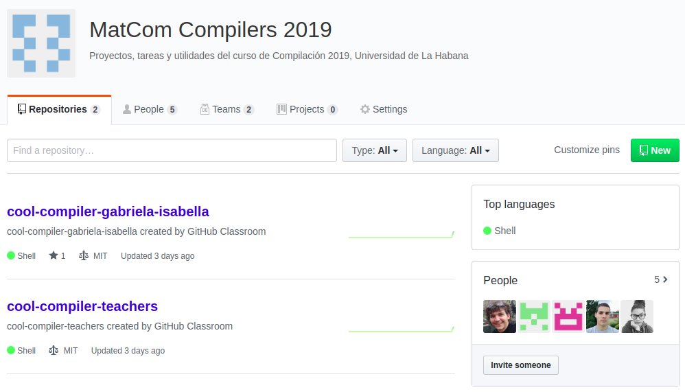
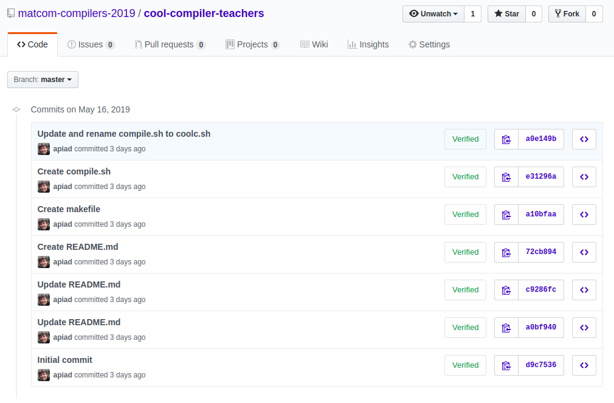

# COOL: Proyecto de Compilación

> Proyecto base para el compilador de 4to año en Ciencia de la Computación.

## Generalidades

La evaluación de la asignatura Complementos de Compilación, inscrita en el programa del 4to año de la Licenciatura en Ciencia de la Computación de la Facultad de Matemática y Computación de la
Universidad de La Habana, consiste este curso en la implementación de un compilador completamente
funcional para el lenguaje _COOL_.

_COOL (Classroom Object-Oriented Language)_ es un pequeño lenguaje que puede ser implementado con un esfuerzo razonable en un semestre del curso. Aun así, _COOL_ mantiene muchas de las características de los lenguajes de programación modernos, incluyendo orientación a objetos, tipado estático y manejo automático de memoria.

## Cómo comenzar (o terminar)

El proyecto de Compilación será recogido y evaluado **únicamente** a través de Github. Es imprescindible tener una cuenta de Github para cada participante, y que su proyecto esté correctamente hosteado en esta plataforma. A continuación le damos las instrucciones mínimas necesarias para ello:

### 1. Si no lo ha echo ya, crearse una cuenta en [Github](https://github.com) (es gratis) para todos los miembros del equipo.


### 2. Hacer click en [este link](https://classroom.github.com/g/QrlsVQA4) y aceptar la tarea, creando un nuevo equipo, o uniéndose a un equipo existente.


### 3. Una vez echo esto, tendrá un nuevo repositorio en [Github/MatCom Compilers 2019](https://github.com/matcom-compilers-2019).



### 4. Clone este proyecto en un repositorio local. Busque la URL de su proyecto en la interfaz web de Github.


```bash
$ git clone git@github.com:matcom-compilers-2019/cool-compiler-<team>.git
```

> Donde `<team>` es posiblemente el nombre de su equipo.

### 5. A partir de este punto debe tener un proyecto `cool-compiler-<team>` local.

El siguiente paso depende de si usted ya tiene su código versionado con `git` o no.

### Si tiene su proyecto en git (y no quiere perder la historia):

6. Mezcle hacia el nuevo respositorio su repostorio anterior:

```bash
$ cd cool-compiler-<team>
$ git pull my-compiler-project master
```

7. Organice su proyecto, código fuente y documentación, de acuerdo a las instrucciones de este documento, y vuelva a hacer `commit`.

```bash
$ mv ...
$ git add .
$ git commit -a -m "Mezclado con el proyecto base"
```

8. A partir de este punto puede hacer `push` cada vez que tenga cambios que subir:

```bash
$ git push origin master
```

### Si aún no tiene su proyecto en git:

6. Simplemente copie el código de su proyecto en la carpeta correspondiente `src` y haga su primer commit:

```bash
$ cp ...
$ git commit -a -m "Hello Git!"
```

7. A partir de este punto asegúrese de hacer `commit` de forma regular para mantener su repositorio actualizado. Si necesita saber más sobre `git`, todo lo imprescindible está [esta guía](doc/github-git-cheat-sheet.pdf).

8. A partir de este punto puede hacer `push` cada vez que tenga cambios que subir:

### 9. Asegúrese de que sus cambios están online en el momento de revisar el compilador.



## Sobre la implementación

Ponga todo su código e instrucciones necesarias en la carpeta `src`. Más información en [`src/Readme.md`](src/Readme.md).

## Sobre la documentación

Usted debe presentar un reporte escrito documentando el proceso de construcción de su compilador y los detalles más importantes de su funcionamiento. Más información en [`doc/Readme.md`](doc/Readme.md).

## Sobre los Equipos de Desarrollo

Para desarrollar el compilador del lenguaje COOL se trabajará en equipos de 2 o 3 integrantes.
